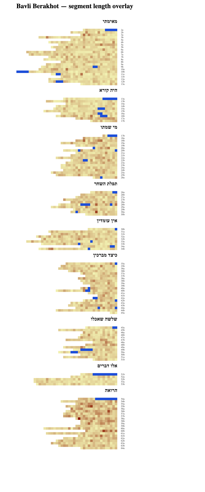

# Talmud Engine Exploration — Memo

**Bead:** tm-7la
**Date:** 2026-04-06
**Status:** Exploration complete
**Deliverables:**
- This memo
- Design doc at `docs/plans/2026-04-06-talmud-exploration-design.md`
- Reference screenshot at `docs/plans/images/2026-04-06-talmud-exploration/berakhot-full-2x.png`

A throwaway prototype was built to validate the design and produce the screenshot. It is **not committed to main** — exploration beads ship understanding, not infrastructure. The design doc contains enough detail for someone to rebuild the prototype in a few hours if needed; the integration follow-up bead (`beads_tm-two`) will write the production version from scratch using `src/`'s engine.

---

## TL;DR

**Recommendation: yes, pursue integration.** The Torah Map metaphor survives the translation to the Talmud, but only after reshaping the layout from "perek as a horizontal row" to "perek as a vertical block of amud-rows." The prototype renders all 2,749 segments of Berakhot in a readable, visually meaningful way with authoritative Mishnah/Gemara tagging and no live API dependencies. Follow-up beads are filed for full-Bavli scaling, Hebrew/Aramaic classifier, and several refinements.

---

## What the Talmud looks like through this engine

Nine perakim, labeled by their traditional Hebrew names. Each perek is a vertical block of amud-rows, right-aligned to a shared right edge. Mishnah segments are bright blue; Gemara segments are colored by character count (pale yellow = short, saturated red = long). The column of small grey labels on the right identifies each daf/amud.

---

## Talmud structure summary

The Talmud has no direct analog to the Tanakh verse. Its natural divisions:

- **Tractate (מסכת)** — a book-equivalent. Bavli has 37.
- **Perek (פרק, "chapter")** — a semantic unit. Berakhot has 9.
- **Daf (דף, "folio")** — a physical page from the Vilna printing tradition, with two sides called **amud a** and **amud b**. Berakhot has 63 dapim (numbered 2 through 64; there is no daf 1).
- **Segment** — Sefaria's finest addressable unit, roughly a sentence or short passage. Referenced as `<Tractate> <daf><amud>:<seg>`, e.g. `Berakhot 17b:11`.

Perek and daf are **orthogonal, crosscutting divisions**. A perek begins or ends mid-daf; a daf can span two perakim. This orthogonality is the main source of layout difficulty.

There is no universal segment count — Sefaria's segmentation is one of several plausible ones — but the same segmentation is stable across all Sefaria data, so the engine is tied to that choice.

### What Sefaria-Export gives us, what it doesn't

All data lives in a public GCS bucket backing the [Sefaria/Sefaria-Export](https://github.com/Sefaria/Sefaria-Export) repo. No auth required; direct HTTPS download.

| Need | Source | Notes |
|---|---|---|
| Hebrew text per segment | `json/Talmud/Bavli/<Seder>/<Tractate>/Hebrew/Wikisource Talmud Bavli.json` | Shape is `text[amudIndex][segmentIndex]`. **127 amudim** for Berakhot, of which 2 (1a, 1b) are empty placeholders. Total **2,749 segments**. HTML markup (`<big>`, `<strong>`, ` `) is stripped during parse. |
| Perek boundaries | `schemas/<Tractate>.json` → `alts.Chapters.nodes[*].wholeRef` | Gives segment-precision ranges like `"Berakhot 2a:1-13a:15"`. One node per perek. |
| Mishnah/Gemara tagging | Same Wikisource Hebrew file; `מתני׳` and `גמ׳` delimiters embedded in segment text | The **Davidson vocalized** version (sefaria-export's `merged.json`) has stripped these markers during editorial vocalization, so Wikisource must be used. Same shape, same segment count, so position-based addressing is interchangeable. Loses nikud. |
| Perek names | `schemas/<Tractate>.json` → `alts.Chapters.nodes[*].heTitle` | Short Hebrew opening-word titles like `מאימתי`, `הרואה`. |

**What's not available statically**: an explicit per-segment Mishnah/Gemara tag. We derive it from a marker walk over the segment stream — see below.

**Risks for full Bavli**: we verified this data coverage only for Berakhot. Wikisource-specific completeness for other tractates is not yet known and is a precondition for the integration bead.

---

## Layout decision and reasoning

The Torah Map's core thesis is *"ragged edge of a row encodes the natural length of a unit of thought."* For the Tanakh that unit is the chapter. For the Talmud it must be the perek, because daf is a typesetting accident — the printer's leaf — whereas perek is the semantic division.

Three layout candidates were considered:

| Candidate | Atom | What the ragged edge encodes | Verdict |
|---|---|---|---|
| **A. Perek-primary, horizontal** | Segment | Perek length in segments (row width) | Worked mathematically but produced a **12.77:1 landscape** canvas with only 9 rows. Too sparse; the "field of patterns" quality was lost. |
| **B. Perek-primary, horizontal with 20-segment wrap** | Segment | Nothing — all rows are the same width; last line of each perek is ragged | Not pursued. |
| **C. Perek-as-vertical-block, amud-per-row** | Segment | Amud length (row width) within a block; perek length (block height) across blocks | **Selected.** |

Option C was selected after seeing option A's empirical output. Two independent observations drove the choice:

1. **The 9 × extreme-landscape layout of A didn't feel substrate-like.** With the Tanakh's 39 books distributed across three sections, the visualization reads as a "field." With only 9 perekim in Berakhot, option A's output looked more like nine long strings stacked together than a field.
2. **The daf/amud is semantically important for navigation**, even if it's not the primary semantic unit. Option A had to fake it by inserting hairline gaps between daf-clusters inside each long row. Option C lets the daf/amud be its own row, which makes daf labels trivially unambiguous (one per row, placed beside it).

### Option C in detail

- Each **(perek, daf, amud)** tuple becomes its own row. Berakhot has 131 such rows across 9 perakim (125 unique amudim plus 6 amudim that straddle a perek boundary).
- Within a row, segments flow right-to-left, 6 px per segment square.
- **Rows stack vertically with no intra-perek gap** — the top and bottom of adjacent rows touch. This packs each perek into a tight block.
- **Between perakim there's a `PEREK_GAP = 30` px vertical gap** plus the Hebrew perek name.
- **All rows share a common right edge** after RTL mirror. This gives the visualization a strong vertical spine where the first segment of every amud lines up.
- **Hebrew perek names** are anchored at the block's right-top corner, rendered with `text-anchor="start"` + `direction="rtl"` so the text extends leftward from the block's right edge.
- **Daf labels** (`"17a"` etc.) form a column to the right of the shared right edge.
- Final dimensions for Berakhot: **285 × 1026 px** (≈ 1:3.6 portrait).

### What this encoding shows

- **Perek length** → block height. `מאימתי` (perek 1) is ~23 amudim tall, `אלו דברים` (perek 8) is ~4 amudim tall. The ratio is visually obvious.
- **Amud length** → row width (ragged left edge). Short amudim stick out as short rows. The paragraph-like texture of each perek block is informative — you can see which parts of a tractate have dense short back-and-forth vs long continuous discussions.
- **Mishnah/Gemara** → blue fill vs length-colored gemara fill. Mishnah blocks cluster at the top-right of each perek (the opening Mishnah, which is the first segment after the perek boundary under RTL), with scattered interior blocks where the Bavli quotes additional mishnayot.
- **Segment length** → pale-yellow → dark-red ramp on Gemara only. Long segments (often aggadic material) show up as darker patches.

---

## What the prototype reveals

This is the substantive evaluation. The prototype's job was to test whether the Torah Map thesis — *"a stable spatial substrate reveals patterns across analytical overlays"* — survives the Talmud. Three observations.

### 1. The ragged-edge metaphor survives, rotated

Option A tested "ragged edge = perek length" and failed on sparseness (12.77:1 with 9 rows). Option C rotates the encoding: perek length becomes vertical extent, amud length becomes horizontal extent. Both are legible at a glance. `מאימתי` being dramatically taller than `אלו דברים` is an immediate visual fact; so is the fact that perakim 1, 6, and 9 have visibly more long-segment density (dark patches) than the middle perakim.

### 2. The Mishnah/Gemara distinction is dramatic even at 3.4%

Only **93 of 2,749 segments (3.4%)** are Mishnah. We initially planned to mark Mishnah with just a border, which would have been invisible at 6 px square size. Switching to a saturated blue fill, completely independent from the length-color ramp, makes Mishnah pop. The visual pattern — a small cluster of blue at each perek's top-right, with occasional interior blue spots — *is* interesting and Talmud-specific information.

In particular, **interior Mishnah blocks are a real signal, not noise**. Berakhot's 34 `מתני׳` markers don't match its 57 mishnayot (5+8+6+7+5+8+5+8+5) — Sefaria groups some consecutive mishnayot under one marker. The interior blue blocks reveal where the Bavli pauses mid-perek to bring in another Mishnah, either breaking up a long perek's mishnayot or quoting from elsewhere.

### 3. The segment-length overlay shows real but subtle texture

This was the most uncertain part of the design. Segment length is the cheapest possible analytical overlay, chosen for the prototype because it needs no linguistic classification. The overlay *does* show structure — certain perakim (notably perek 6 `כיצד מברכין`, perek 9 `הרואה`, and parts of perek 1) have visibly more dark/long segments than others. This correlates with where aggadic material and long derashot live.

But the signal is muted. Most Gemara segments are within ~1.5× of the median length, so the ramp compresses into a narrow band of yellows and tans with occasional darker patches. **A Hebrew/Aramaic classifier overlay would almost certainly be more dramatic**, because the Bavli code-switches constantly — quoting Hebrew Mishnah/Tanakh verses within otherwise-Aramaic Gemara discussion. See follow-ups.

### Honest caveats

- **Sparseness is still a concern.** 9 rows is better than nothing, but it's nothing like the Tanakh's 39-book field. Some perakim have only 4 amud rows — `אלו דברים` is almost a thumbnail. The visual impact for the Talmud is likely to scale much better once *multiple tractates* are shown together (a seder-level or Bavli-level layout).
- **The perek name labels are placed formally.** In the current prototype they're 13 px bold black Hebrew headers floating in the inter-perek gap. They read well but look like a book's table of contents rather than something integrated with the substrate. Visual refinement is deferred to a follow-up.
- **The daf label column on the right is visually noisy.** 131 labels in a single column at font-size 6 is legible but cluttered. Probably wants a different placement strategy (e.g., only labels for round-numbered dapim, or a hover-only reveal in the eventual integrated version).
- **No interactivity.** The SVG is static. The real engine has hover/click/zoom, and those matter a lot — a user will want to click a segment to see the Hebrew text, which the Torah Map already does well.
- **Berakhot only.** We have no evidence about other tractates' data completeness in Wikisource, the visual density of larger tractates like Shabbat or Bava Batra, or whether seder-level layout is tractable.

---

## Recommendation

**Pursue full integration.** Specifically:

1. **Yes on the metaphor.** Option C is a legitimate substrate for the Talmud. The "ragged paragraph blocks" reading is coherent, informative, and uses the same visual vocabulary as the existing Torah Map (colored squares as atoms, length-coded colors, section headers, distinct overlays).
2. **Yes on the data pipeline.** Sefaria-Export's Wikisource JSON + schema file is a clean static input with no live API dependencies. The marker-walk approach (`מתני׳`/`גמ׳`) produces authoritative Mishnah/Gemara tagging without heuristics.
3. **Yes on the next bead.** The integration bead should target all 37 tractates of Bavli. Its first task is verifying Wikisource completeness per tractate (one grep per file), and the second is deciding the seder/tractate layout (the analog of the Tanakh's three-section arrangement).
4. **Cautious on timing.** The integration bead is not small. It touches layout, data loading, overlays, URL state, verse-text loading, search, and labels. The current prototype is **~600 lines of throwaway code**; a production integration behind a `?corpus=talmud` flag is probably an order of magnitude more. Budget accordingly.

**If I had to pick one thing to validate before starting the integration**, it would be running the prototype's data pipeline against a few other tractates to confirm Wikisource coverage. That's a 30-minute task and it unblocks the planning.

---

## Follow-up beads (to be filed during Phase 9 close-out)

Each of these becomes a bead with `discovered-from:tm-7la`. The list is longer than any single integration can reasonably absorb — the integration bead (#1) is the gate, and the overlay/layout beads depend on it.

### Infrastructure

1. **Engine integration for full Bavli** *(priority 2, feature)*. Wire the prototype's data pipeline into the main app behind a corpus flag. Reuse `computeTalmudLayout` via code-lift (not import). Handle multi-tractate layout, Mishnah/Gemara as a first-class overlay, daf labels as a sparse reveal. First sub-task: verify Wikisource coverage for all 37 Bavli tractates.
2. **Verify Wikisource coverage across all Bavli tractates** *(priority 2, task)*. Gating check for the integration bead. Fast: download each tractate's Wikisource JSON and check that segment counts and `מתני׳`/`גמ׳` marker counts look plausible.
3. **Refine perek name label styling** *(priority 3, task)*. Current labels feel formal, large, and high. Experiment with smaller font, different vertical offset, or moving them inline with the first daf label of each perek. Discovered while reviewing the prototype.

### Content features (hover, detail, sidebar)

4. **Load and display English translation in the hover box / sidebar** *(priority 2, feature)*. Sefaria-Export's bucket includes English versions (e.g., William Davidson English). The main app's sidebar already shows Hebrew + English for verses; do the same for segments.

### Overlays — text search and analytical patterns

5. **Full-text search overlay** *(priority 2, feature)*. Analog of the existing Tanakh search. Hebrew-aware, nikud-insensitive, matches across the 2,749-segment substrate. Most likely the single most-used overlay once the integration ships.
6. **Rabbinical name search** *(priority 2, feature)*. Distinct from general text search because rabbinical references follow stereotyped forms (`רַב`, `רַבִּי`, `ר׳`, `רבא`, etc.) and are a first-class Talmud interest. Given a name or name-pattern, highlight every segment that mentions it.
7. **Argumentation-pattern overlays** *(priority 3, feature)*. Highlight segments containing canonical Gemara phrases. Starter set:
   - `קל וחומר` (kal v'chomer — a fortiori argument)
   - `לא קשיא` (lo kashya — "it is not difficult", a standard dialectical move)
   - Citation-introduction formulas (`תַּנְיָא`, `אִתְּמַר`, `תָּנוּ רַבָּנָן`)
   - Potential extensions: gezerah shavah, binyan av, other hermeneutic rules.

   Each phrase becomes one highlight-all overlay. Cheap to compute (substring match over the segment stream) and visually striking — the overlay reveals the distribution of that rhetorical move across the tractate.
8. **Hebrew/Aramaic classifier for Talmud** — *already filed as `beads_tm-dqv`* with a full design doc and working prototype at `scripts/hebrew-aramaic-prototype/`. Mentioned here for completeness; do not file a duplicate.
9. **Commentary-link-count overlay for Talmud** *(priority 4, feature)*. The existing Torah Map has a commentary heatmap using Sefaria links data. Port it to the Talmud for analytical substrate depth.

### Overlays — cross-corpus

10. **Cross-reference to Torah with verse-color gradient** *(priority 3, feature)*. Highlight segments that quote or reference the Torah. Color each highlighted segment by the *location* of the cited Torah verse, so early-Genesis citations are one color and late-Deuteronomy citations are another. This turns the Bavli visualization into a distribution plot of "which parts of the Bavli draw from which parts of the Torah." Data source: Sefaria's links CSVs.
11. **Text dating by rabbis mentioned** *(priority 3, feature)*. Analog of the existing Tanakh text-dating overlay, but using tanna/amora generations. Each named rabbi has a known generation (Tannaim 0–220 CE, Amoraim 220–500 CE, subdivided into generations). The "age" of a passage is the latest rabbi it mentions. Depends on the rabbinical-name-search bead (#6) for the name-detection infrastructure.

### Scope / layout questions

12. **Multi-tractate / Seder layout question** *(priority 3, task)*. How do tractates arrange within a seder? How do the six sedarim arrange? The Tanakh's answer ("three horizontal sections") may or may not translate. Investigate layouts that treat tractates as "books in a section."
13. **Mishnah-as-standalone-corpus question** *(priority 4, feature)*. The Mishnah exists independently of the Talmud (6 sedarim, 63 tractates, ~4,000 mishnayot). Would it be a separate visualization, a separate corpus toggle, or an overlay on top of the Talmud showing "here's where each Mishnah lives"?
14. **Explore alternative layout schemes for Talmud** *(priority 4, task)*. Option C is one point in a large design space. Others worth prototyping: daf-as-tile grid (one tile per daf, perek as a colored frame), sugya-as-unit (requires sugya-boundary inference), or a seder-level mosaic where tractates tile hexagonally. Low-priority exploration — only after the integration and core overlays ship.

---

## Artifacts

**Committed to main:**
- `docs/plans/2026-04-06-talmud-exploration-design.md` — the settled design
- `docs/plans/2026-04-06-talmud-exploration-memo.md` — this file
- `docs/plans/images/2026-04-06-talmud-exploration/berakhot-full-2x.png` — reference render

**Built but not committed (existed only in the tm-7la worktree during exploration):**
- A throwaway prototype under `scripts/talmud-prototype/` — ~600 lines of TypeScript across `fetch.ts`, `parse.ts`, `layout.ts`, `colors.ts`, `render.ts`, `main.ts`, `snapshot.ts`, plus types and 37 vitest tests; cached Wikisource + schema JSON; the generated `berakhot.svg`. The prototype passed all 37 of its own tests and the full repo suite (1,443 tests across 46 files) before the exploration was closed.

**To rebuild it**, the design doc has the data sources (URLs in §4), the layout algorithm (option C in §2), the marker-walk M/G rule (§3), and the SVG render approach. A fresh build is a few hours' work and is intentionally what the integration follow-up bead (`beads_tm-two`) will do, this time inside the main app's WebGL engine rather than as a standalone SVG generator.
