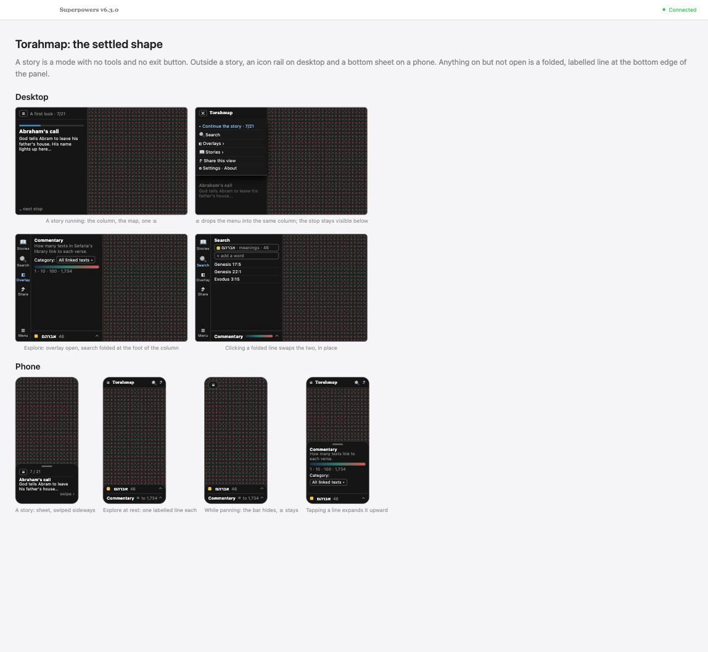

# Where everything lives: menus, modes and the panel

**Date:** 2026-09-23
**Status:** Designed, not built.
**Issues:** #236 (the phone), #234 (search beside an overlay), #235 (more than
one story), #237 (what an overlay is), and the "share a view" half of #232

## The problem

Four issues arrived separately and turned out to be one. The interface grew a
control at a time, and every control ended up in the same container: the 380px
right panel on desktop, the bottom sheet on a phone. That container now holds
the story, the overlay picker, the chosen overlay's options, its legend, a line
summarising all of it, and a footer of links. Two of those things are modes and
the rest are tools, but nothing on screen says so.

The visible symptoms:

- A reader on a phone sees a strip of colour above the story and cannot tell
  what it is (#236). It is the overlay summary and legend, and nothing labels
  it.
- Picking a search replaces the overlay and picking an overlay clears the
  search, because Text Search is an entry in the overlay list (#234).
- Leaving or resuming the story is a link in a footer, so the mode switch is
  the least visible control on the page.
- An overlay's one-sentence description exists but is only shown in the help
  window, where nobody reads it while using the overlay (#237).
- There is one story and no way to offer a second (#235).

## The shape

Three ideas carry the whole design.

**A story is a mode, not a drawer.** While a story runs there are no tools on
screen: a column of text on desktop, a sheet on a phone, the map, and one ☰.
There is no exit button, because "leave" was two different things wearing one
word. Moving the map during a story — panning, zooming, pinning a verse — takes
the camera from the story and gives it back at the next stop; that already
works and is not leaving. Leaving is wanting a tool the story does not offer,
so it happens through the menu, or when the story runs out and hands you the
map. A story keeps its place, so Stories always offers to resume.

**The menu drops into the panel the story already owns.** ☰ slides the menu
down over the top of the column, leaving the current stop visible below it,
dimmed. The first item is "Continue the story · 7/21"; then Search, Overlays,
Stories, Share this view, and Settings & About. Closing it returns to the
story; choosing a tool ends the story and leaves the reader standing on the
view it had reached, with its colours still on.

**Outside a story, anything on but not open is a folded line at the bottom edge
of the panel.** On desktop the panel is a column beside an icon rail; on a
phone it is the sheet. A folded line names the thing and shows its legend in
one row — "Commentary ▬▬ to 1,734 ⌃", or a swatch, the search word and its hit
count. Tapping it expands it in place, and whatever was open folds down to take
its place. Nothing travels across the screen, and nothing colours the map
without a label somewhere on it. Since a story is a mode rather than a tool, at
most two lines can be folded at once.

## Search and an overlay together (#234)

Search stops being an overlay and becomes its own tool: its own rail icon on
desktop, its own icon in the top bar on a phone. The overlay picker then only
chooses how the map is coloured.

When both are on, the search hits take the fill in their term colours and the
overlay stays behind them, dimmed. This reads at every zoom and keeps the five
term colours working. The alternative of ringing each hit was rejected: ring
thickness is measured in map units, so at the zoom where you want to see a
word's distribution across the Tanakh the rings are thinner than the squares.

The overlay becomes context rather than a value you can read off a hit. For
"which of these verses is in the prayerbook", the shape of the dimmed
background answers roughly and the pinned verse answers exactly. A stricter
answer — dim every non-matching verse, and let the overlay colour only the
matches — is worth offering later as a switch beside the search box, but it is
not the default, because it throws away the map of everything.

## The two layouts

**Desktop** gets an icon rail: Stories, Search, Overlay, Share, and ☰ Menu at
the foot. The rail is only present outside a story — its absence is what makes
a story a mode. Clicking an icon opens that tool's panel in the column beside
it.

**Phone** gets a top bar — ☰, the name, search, share — that hides as soon as
the map moves, leaving a floating ☰ behind. At rest the sheet is nothing but
the folded lines, one per active thing. The ☰ menu lists the same items as the
desktop menu.

Neither layout has a story strip, a summary line, or a footer of links any
more. The footer's contents move: Hide Hebrew into Settings, About & credits
into the menu, and the story links into the mode itself.

## What each overlay says about itself (#237)

The description each overlay already carries is shown at the top of its panel,
above its options, on both sizes. The help window's Overlays tab keeps being
built from the same strings, so there is still one source. An overlay with
sub-options (Commentary's category, Haftarah's custom) describes the sub-option
on the same line it is chosen from, since "Liturgy" alone does not say what it
counts.

## Stories as a list (#235, #232a)

Stories move from one file to several under `public/data/stories/`, each with a
title and a one-line description the app can read for the menu. The URL names
the story and the stop. Today's `#story=<stopId>` assumes a single story, and
#235 says back-compatibility is not needed, so the hash carries both: story and
stop.

A story shows its progress while it runs and remembers where it got to, which
is what makes "Continue the story" and "Resume" honest. Where that memory lives
— the session, or the address — is an implementation question, not a design
one.

Nothing here hosts other people's stories; that is #232c and stays out of
scope.

## Sharing a view (#232b)

"Share this view" in the menu copies a link to exactly what is on screen: the
overlay and its settings, the search terms and their modes, the pinned verse,
the camera. On a phone it opens the system share sheet. Inside a story it
shares the stop instead, since that is what the reader is looking at. The URL
already carries all of this; the work is a control, a copy, and a confirmation
that something was copied.

## How this lands in the code today

The design moves furniture that is spread across a dozen modules. This is the
map, so that a plan can be written without rediscovering it.

**The container.** `index.html` holds the panel's markup; `src/styles/right-panel.css`
makes it a five-row grid accordion where exactly one of the controls and the
story is open, and turns it into a bottom sheet under `max-width: 768px`.
`src/main.ts` owns the wiring — `phoneLayout`, `setSheet`, the toggle handlers,
the fold and open calls. `src/sheet.ts` holds the phone's three heights
(`down`, `normal`, `tall`) and the drag arithmetic. `src/panelSummary.ts` builds
the summary line that the folded lines replace. The accordion, the summary line
and the footer all go; the rail, the folded lines and the menu are new.

**The story.** `src/scrollytelling/storyPanel.ts` fetches and renders
`public/data/story.md`; `storyParser.ts` reads the stop directives;
`driver.ts` decides when the reader has taken the camera and when the story
gets it back; `overlayBlender.ts` and `colorBlending.ts` carry the colours
between stops. The mode rule — which links open the story — is
`resolveViewState` in `src/viewState.ts`, and it already has a `story` /
`explore` distinction to build on.

**Search as an overlay.** `src/overlays/index.ts` registers it alongside the
other four; `src/overlays/search/` is the overlay itself, with the term rows,
results list and highlighting; `src/search/` holds the matching and dictionary
work, which does not care how it is presented. Pulling search out of the
registry is the change with the widest blast radius, because the registry is
what the URL, the story stops, the help tab and the summary line all read.

**Colouring.** `src/itemColoring.ts` computes each verse's state and then
applies colours in two passes, which is where hits-in-front-of-a-dimmed-overlay
belongs. `src/overlays/legend.ts` builds the legend axes the folded lines will
show in miniature.

**Settled while writing this:**

- **The verse popup stays as it is** (`src/sidebar.ts`, `src/styles/verse-popup.css`):
  bottom-left on desktop, above the sheet on a phone.
- **The zoom buttons stay as they are** (`src/styles/zoom-buttons.css`): a
  corner control on desktop, hidden on phones, where pinch does the job.
- **The URL** names things directly: `story=<story name>&stop=<stop id>` for a
  story, and `search=<terms>&overlay=<overlay id>` for the explore view, since
  the two are no longer alternatives. `RESERVED_KEYS` in `src/urlState.ts` is
  the list to change, and `overlay=search` stops being a legal value.
- **How far the background overlay dims** is a number to find by eye once it is
  on screen, not a decision to make on paper.
- **Telemetry** (`src/analytics.ts`, `src/telemetry/schema.ts`) mostly stands.
  Two events describe things that change shape: `overlay_switch` will never
  again report `search` as an overlay, and `story_exit`'s `how` values come
  from controls — the footer link, the summary toggle — that this design
  removes. Both want re-reading against the new controls rather than redesign.
- **Testing.** `playwright` is already a devDependency and the headless browser
  renders the map, so the frame's states — rail, folded lines, menu over the
  story, the phone bar hiding — can be driven and looked at directly, which
  matters for a change whose whole content is layout. The state underneath
  (which panel is open, what a folded line says, what the URL holds) stays in
  vitest, where the existing 1,900 tests are.

**Still open in the code:**

- **The help window.** About & credits moves into the menu, but the modal
  itself keeps four tabs, one of which is Controls — a list of interactions
  this design rewrites, and another is Overlays, built from the same
  descriptions now shown in the panel. Whether it stays a modal, becomes a
  menu section, or splits is undecided.
- **The phone's sheet heights.** `down`, `normal` and `tall` were built around
  one open thing. With folded lines the resting height is the lines themselves,
  and the tall state exists for reading and typing, so the ladder needs
  rethinking rather than porting.

## What this leaves open

- Whether the "dim everything that doesn't match" switch ships with this or
  later.
- Whether the resting sheet on a phone with nothing on says "No overlay" or
  disappears. The decision was "No overlay", but it is worth looking at once it
  is real.
- The rail's icons, which are a design job of their own. The emoji in the
  mockup are stand-ins and look like it. What replaces them has to survive
  being small and unlabelled, read at a glance against a dark background, and
  sit with the rest of the site rather than borrowing a generic icon set. Five
  are needed on desktop, plus search, share and ☰ on the phone bar. Worth
  settling before the frame ships, since the rail is the first thing a reader
  meets outside a story.
- Whether search results on desktop belong in the panel, as they are today, or
  deserve more room now that the panel is narrower.

## Order of work

Each step should be a branch that stands on its own, and each changes what the
reader sees, so each wants your eyes before the next.

1. **The frame.** The rail, the panel, folded lines, the ☰ menu, the phone top
   bar that hides. Story mode is still the existing single story; the overlay
   list still contains Text Search. Nothing about the map changes.
2. **Search leaves the overlay list** and becomes a tool, with hits drawn over
   a dimmed overlay. This is the only step that touches colouring.
3. **Descriptions and share.** Each overlay's sentence in its panel, "Share
   this view" in the menu.
4. **More than one story.** The stories directory, the menu list, the URL, and
   resume.
