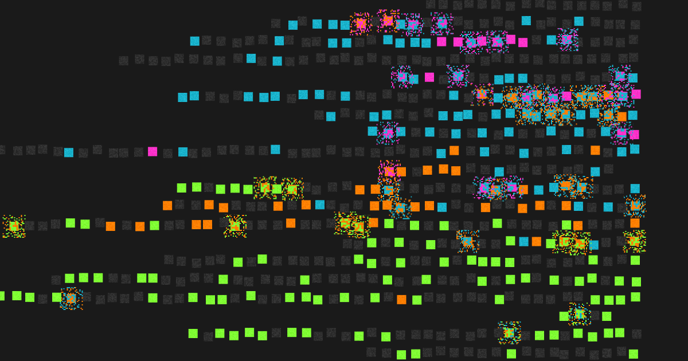
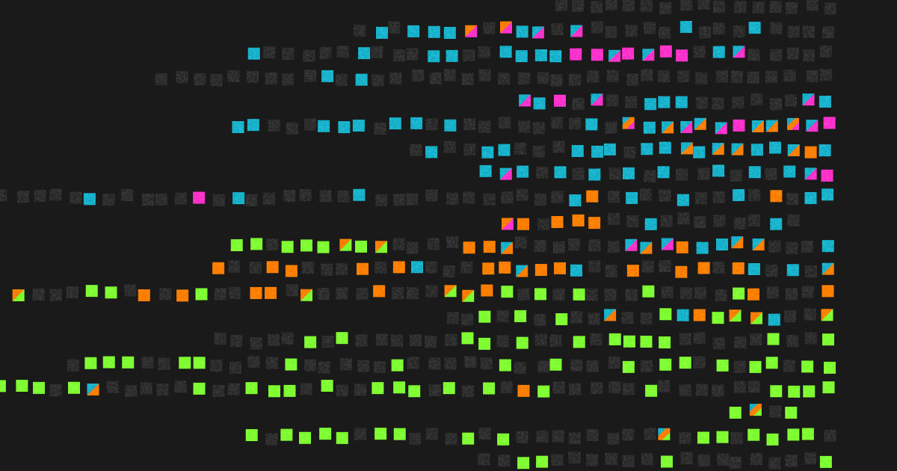
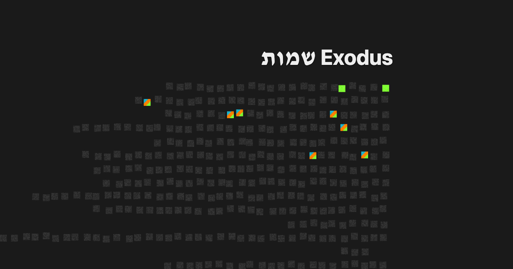
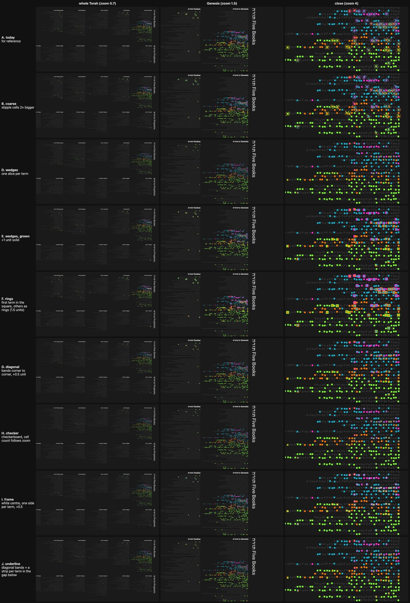
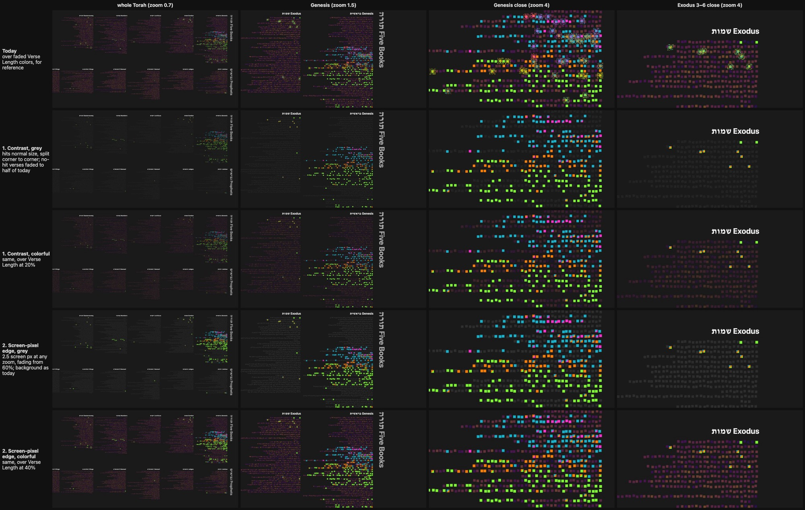

# Verses Several Search Terms Hit

**Date:** 2026-09-24
**Status:** Decided and built (#246).

## The problem

A verse that two or more search terms hit used to grow a halo three units wide
past its square, about 30% filled with random specks of the terms' colours. It
was sparse, took a lot of space, and blurred into mud from a distance. It also
made multi-hit verses look more important than single hits.

## What we wanted

- Every hit visible on its own square, even from a distance.
- No extra weight for a verse several terms hit.
- Still clear that there are several.

## The decision

A multi-colour verse keeps exactly its own square, split corner to corner into
one band per colour. Single hits are unchanged. This is the shared shader, so
Haftarah's multi-item verses get the same treatment.

A diagonal cut, not a vertical one: a square split down the middle reads as two
neighbouring verses.

## What we tried

Twenty-odd variations, compared on screenshots at three zoom levels. The
prototype is on branch `multi-hit-246-prototype`, every style behind
`?multi=<name>`.

- **Specks, coarser or denser.** Still static, and the colours still blur.
- **Pie wedges, rings, checkerboard, a white-centred frame, an underline.**
  Rings and the frame read well but emphasise multi-hit verses; the
  checkerboard turns to texture; the underline disappears.
- **Growing every hit, with a speckled halo, a solid edge or a translucent
  glow.** The gap between squares is two units, a couple of screen pixels at
  the zooms that matter. Anything drawn there reads as the square being bigger
  or blurrier, never as a halo: every version looked swollen or static.
- **An edge a fixed number of screen pixels wide.** Holds up best of the
  growing kind, but still adds an outline nobody asked for.

## For later: search over another overlay

Search will soon draw over another overlay's colours rather than grey. Faded
Verse Length colours at 40% were too bright behind the hits and 20% too dim;
aim for 30%. The old speckled halo was lost entirely against colour, which the
diagonal split avoids by staying inside the square.
