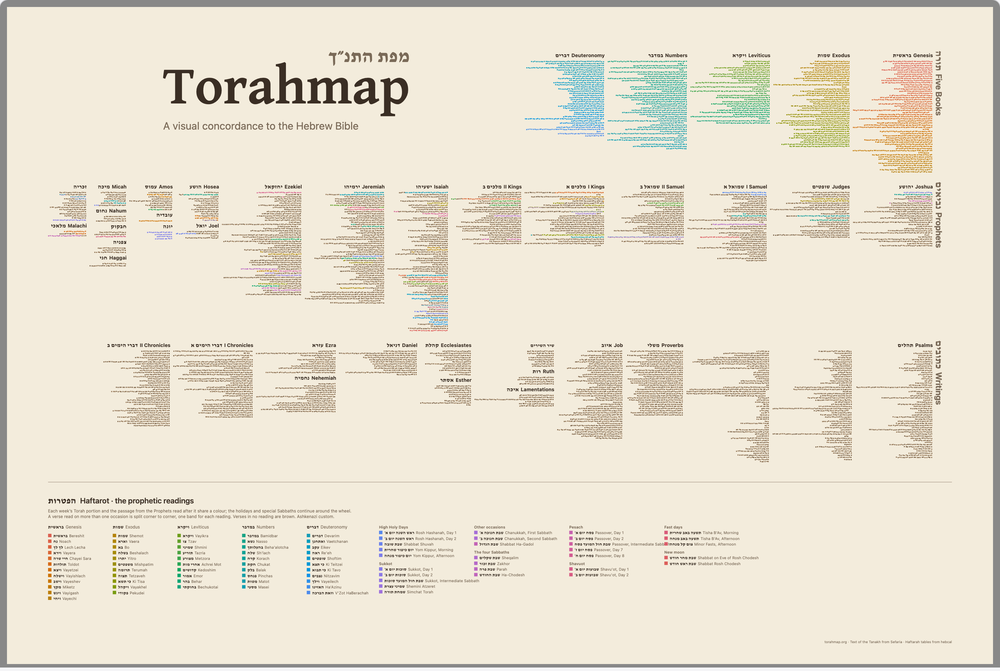
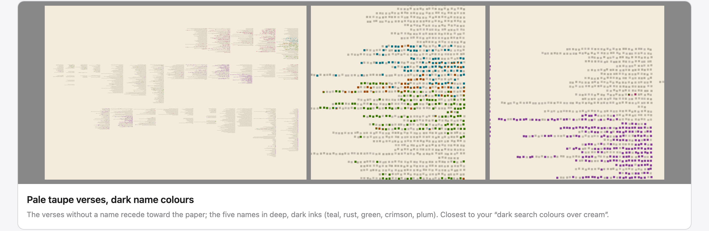

# A Wall Print of the Map

**Date:** 2026-09-29
**Status:** Design and spec agreed; not yet built.

## The problem

Danyel wants two 24×36 inch wall prints of the map, each close to a single
still of the site: the logo, every verse square, and a legend. The first view
is the haftarah overlay across the whole map. The second is a search for the
five names אברהם, יצחק, יעקב, משה and דוד. The prints go to a print shop as
finished files, with no further work needed, though he may polish them in Figma.

This is a print run, not a feature of the site. A script produces the files.
If he makes more prints later, an agent will adapt the script, so it needs to
be readable, not general.

## Decisions

- **The script is kept apart from the app.** It lives in `scripts/print/` and
  changes nothing under `src/`, `packages/` or `public/data/`. Like
  `scripts/search/click-resolution-report.ts`, it runs under plain Node,
  serving `public/` through its own `fetch`. It imports what does not need the
  page: `src/layout.ts` for where each verse sits,
  `src/overlays/haftarah/readings.ts` for which verse belongs to which reading,
  and `src/search.ts` for which verses name each person.
- **It writes an SVG, then a PDF from the SVG.** The SVG is the source, and
  what goes to Figma. Headless Chromium, through the Playwright the layout tests
  already use, prints it to a vector PDF with its fonts embedded. `pdftoppm`,
  already installed, turns the PDF into a 300 dpi PNG for shops that want an
  image.
- **The files are print-ready.** Each is 36×24 inches landscape, plus ⅛ inch
  of bleed on every side and crop marks. The cream is printed as a tint over
  the whole sheet rather than left to the paper, so the files print the same on
  any stock. Colours are sRGB and tagged as such: an inkjet shop's own software
  converts them for its printer and paper, and a CMYK file would only narrow
  what that printer can reach. The one exception is a shop that demands
  PDF/X-1a, a CMYK-only standard; the file would be converted with that shop's
  colour profile at the end.
- **What is duplicated is small, and knowingly so.** The rule for which reading
  a verse shows (about 20 lines of `colorAt` in `src/overlays/haftarah.ts`),
  and the placing of book and section titles (`src/labels.ts`), are rewritten in
  the script, because the originals build page elements. If the site changes
  either rule, the print does not follow. For a print run that is acceptable.
- **No signature.** Danyel dropped it.
- **English is set in Inter, Hebrew in David Libre.** The site sets English in
  `system-ui` (SF Pro on a Mac), which a PDF can embed but an SVG cannot
  name for Figma. Inter is close to it, and Figma has it built in. Both faces
  come from Google Fonts; the PDF embeds them.

## Colour

Every colour is chosen for ink on paper, not taken from the screen. Printed on
cream, the site's colour wheel glares in yellow and green and goes dark in blue
and violet. Its colours are evenly spaced by the numbers, not by how bright
they look.

- **Paper:** `#f3ecdc`. **Titles:** `#3a2e24`, with `#7a6a58` for the quieter
  text.
- **Haftarah print.** Verses in no reading are walnut brown: hue 31°, 28%
  saturation, lightness varying per verse between 34% and 47%. The variation
  plays the part the site's random grey does. Readings keep the site's order
  around the wheel, starting from red at Bereshit. They are computed in OKLCH,
  a colour space in which equal numbers look equally bright, at lightness 0.64
  and chroma 0.16. Chroma is lowered, colour by colour, until the colour fits
  sRGB. Hue starts at 29° and steps by 360/83 per reading.
- **Search print.** Verses naming no one are a pale taupe: hue 37°, 13%
  saturation, lightness 66–73%. The names are dark inks at OKLCH lightness 0.5
  and chroma 0.15: Abraham teal (215°), Isaac rust (50°), Jacob green (135°),
  Moses crimson (355°), David plum (320°). The site gives David yellow, but
  yellow darkened for print turns olive, too close to Jacob's green.
- **Search matches are the proper names only.** With every meaning checked, as
  the site defaults, יצחק also finds "laugh", משה finds "lamb" and "loan", and
  דוד finds "beloved one" and "cooking pot". The print keeps only the meanings
  glossed Abraham, Isaac, Jacob, Moses and David: 159, 101, 319, 705 and 912
  verses.
- **A verse in two readings, or naming two people, is split corner to corner,**
  one band each, and the bands slide apart along the cut, as on the site. Each
  band is its slice of the square, moved along the cut by `BAND_OFFSET` (from
  `src/geometry.ts`, imported rather than copied) times its distance from the
  middle band.

The screen is only a guide to these colours. A proof print settles them (see
*Proof sheet*).

## Layout

The layout was chosen from three drawn at full size; the picture at the top is
the one agreed.

- **Margin** 1½ inches all round, inside the bleed.
- **Psalms runs in three columns,** chapters 1–50, 51–100 and 101–150, where
  the site has two. That makes the Writings shorter, so the map can fill the
  sheet's width (about 32.3 inches) and still leave room for the key. The
  layout code makes at most two columns, so the script gives `computeLayout` a
  copy of the structure. In the copy, Psalms is two books. The first is split
  in two as the site does, and the second, holding chapters 101–150, becomes
  the third column. Afterwards the script renames the second part back to
  Psalms and shifts its chapter numbers. The site's layout is untouched.
- **The logo sits where the site puts it:** centred in the empty corner left
  of the Torah, 929 map units wide, its top 28 units above the Torah's first
  row. The artwork is `src/mapTitle.svg`, recoloured to the title inks, without
  its drop shadow.
- **Book titles** sit right-aligned over each book, the Hebrew in David Libre
  and the English beside it, both bold, in the same ink. The Hebrew is 1.15
  times the size of the English, as `HEBREW_LABEL_SCALE` sets it on the site.
  Where a book is too narrow for both, the English goes, and then the Hebrew
  shrinks.
- **Section titles** (תורה Five Books, נביאים Prophets, כתובים Writings) are
  turned to read downward, just right of each section, as on the site.
- **A hairline runs under the map, and the key sits beneath it,** aligned to
  the map's left edge.
- **A credits line** sits in the bottom margin, at the right: torahmap.org and
  the data sources (Sefaria for the text; hebcal for the haftarah tables; the
  ETCBC BHSA for the search).

### The haftarah key

It follows the key in the site's panel, in more detail:

- a title, הפטרות Haftarot, and two lines explaining that a portion and its
  haftarah share a colour, that a verse in several readings is split, that brown
  means no reading, and that the custom is Ashkenazi;
- five columns, one per book of the Torah, listing each portion with its
  swatch, Hebrew name and English name;
- four columns for the holidays and special Sabbaths, two kinds each: High Holy
  Days with Sukkot, other occasions with the four Sabbaths, Pesach with Shavuot,
  fast days with the new moon.

The holiday columns are a little wider than in the picture, so the longest
names ("Passover, Intermediate Sabbath") clear the next column.

### Type and spacing

In points on the trimmed sheet (2592 × 1728). The code that drew the agreed
mockup is in `scripts/print/prototype/`, the starting point for the script.

| Element | Setting |
| --- | --- |
| Map | top 34 below the margin; width the sheet's less the margins and 50 for the section titles; centred |
| Book title | Hebrew 15, English 13, both bold, 5 apart; baseline 9 above the book's first row; the Hebrew shrinks no smaller than 9 |
| Section title | Hebrew 25.3, English 22, both bold, quieter ink; 8 right of the section, starting 26 above its first row |
| Hairline | 0.75, quieter ink, 50 below the map, across the map's width |
| Key title | Hebrew 23 bold, English 20 semibold; baseline 56 below the hairline |
| Key notes | 11, quieter ink, lines 15 apart |
| Portion columns | 170 wide; heading Hebrew 12.65, English 11; rows 15 apart, swatch 9 square, Hebrew 11.5, English 10 |
| Occasion columns | 270 wide, starting 20 after the portions; kind headings 10 semibold |
| Credits | 9, quieter ink, right-aligned, baseline 54 above the sheet's bottom edge |

Every Hebrew size is 1.15 times the English beside it.

### The search key

Not yet drawn. The plan is five rows, one per name: swatch, Hebrew, English,
and the number of verses. A line says that each verse naming a person is
marked, and that a verse naming two is split. It will be shown to Danyel before
the files are final.

## Proof sheet

Beside the two prints, the script writes a letter-size proof: two patches of
the map at full print scale, one from each print, and a swatch of every colour
used, each labelled with its value. It costs a few dollars at the shop that
will make the prints, and it is the only reliable way to judge these colours
on the paper.

## Checks

- A test pins the Psalms rearrangement. Every verse of the Tanakh appears
  exactly once, Psalms keeps its 150 chapters in order, and the three columns
  do not overlap each other or the next book.
- The script refuses to run if a reading or a kind of occasion has no place in
  the key, rather than silently leaving it out.
- The output is judged by eye: the PNG read at full size, then the proof print.
  A test cannot tell whether a print looks right.

## Open questions

- **The search key's design,** above.
- **The shop.** Nothing in the files depends on it, unless it demands PDF/X-1a
  or supplies a colour profile worth previewing against.
