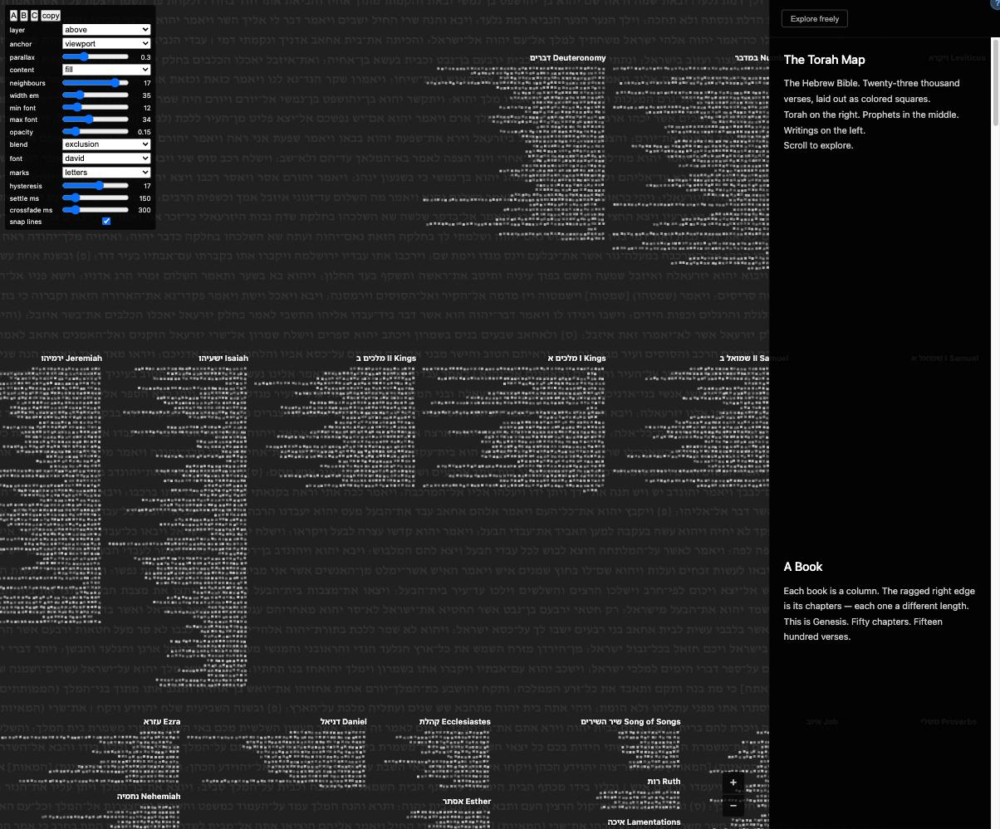

# Background Hebrew text: prototype round

Issue: https://github.com/danyelf/torahmap/issues/142

## Why

A user zoomed into Genesis 1:1 and saw nothing that said "bereishit bara
elokim" until they clicked a square. They wanted the reassurance that the text
was there. The idea is a quiet layer of low-saturation Hebrew text showing the
verse nearest the screen center and its neighbours, sized so that it reads as
ambience when zoomed out and as a legible passage when zoomed in.

This round builds one prototype with live controls rather than three separate
prototypes, so the variants can be compared on the same view. It answers three
questions:

- Is a textual background elegant or annoying in the full tool?
- How does panning feel when the text is attached to the glass versus the map?
- How often should the text change as the center verse moves, and how is the
  change hidden?

Nothing in this round decides the shipped defaults. The prototype is enabled
only by a URL flag.

## Facts about the map that constrain the design

- Verse squares are 6 world units. Zoom runs 0.1x to 10x, so a square is 0.6px
  when fully out and 60px when fully in.
- Rows within a chapter are 2 units apart, books 12 units apart, sections 70.
  The squares cover roughly three quarters of the map's area at every zoom, and
  the row gaps are always narrower than a line of text. Text strictly behind the
  squares shows only in gaps and margins.
- Squares in a row are 6 units apart, at most 60px on screen. A verse at 24px
  runs 300 to 500px wide, so per-verse text anchored at every square would
  overlap many times over. Text in the world is therefore either one verse at
  its square, or one paragraph anchored at the center verse's square.
- All verse text is loaded at startup; picking neighbours is a synchronous
  lookup.
- Rendering is on demand. `render()` in `src/main.ts` runs after each input
  event and already repositions the DOM book labels in the same frame.
- The WebGL canvas clears to opaque dark grey, and the page body behind it is
  the same grey.

## The model

The prototype exposes independent axes. The three named presets from the
discussion are points on these axes.

### Zoom law

Font size interpolates on a log scale between a size at minimum zoom and a size
at maximum zoom:

    t = log(zoom / MIN_ZOOM) / log(MAX_ZOOM / MIN_ZOOM)
    fontPx = minFont * (maxFont / minFont) ^ t

With the defaults of 12px and 24px, equal wheel steps give equal font steps,
and the text grows at about a sixth of the map's rate. Both endpoints are
controls.

### Attachment: parallax ratio, 0 to 1

The layer's screen offset is the map's screen translation multiplied by the
ratio. At 1 the text is glued to the map. At 0 it does not move during a pan.
In between it drifts, the classic background feel.

### Anchor: viewport center or the center verse's square

Viewport anchoring centres the text block on screen; only the parallax slide
moves it. Square anchoring positions the text so the first word of the center
verse sits on that verse's square, and the paragraph flows away from there in
reading order. Chapters run right to left and stack downward, so the paragraph
flows roughly the same direction the map does.

### Content: the center verse alone, or a window of N neighbours each side

The window is in canonical order across chapter and book boundaries, as one
paragraph. Verse boundaries are marked only by a space (a control may add a
sof pasuk later if it helps).

### Presets

| Preset | Anchor   | Parallax | Content     |
| ------ | -------- | -------- | ----------- |
| A      | viewport | 0.3      | window      |
| B      | square   | 1        | center only |
| C      | square   | 1        | window      |

## When the content changes

The center verse is the square nearest the screen center, found by a linear
scan over all verses (well under a millisecond, no spatial index).

At 1x zoom the center verse changes every 6px of pan, so regenerating on every
change would flicker. Two policies, both controls, both applied:

- Hysteresis H in verses. Keep the current paragraph until the center verse is
  more than H verses (by global index) from the verse the paragraph was built
  around. Default 3.
- Settle delay D in milliseconds. Regenerate only once the camera has been
  still for D. Default 150. Zero means continuous.

Every regeneration crossfades between two stacked copies of the layer over a
control-set duration (default 300ms), so a swap is never a cut. With square
anchoring the new paragraph anchors at the new center verse, so the crossfade
covers a position jump as well as a text change. How large H and D must be to
hide that jump is one of the things the prototype exists to find out.

Zooming does not by itself trigger a regeneration. The existing paragraph is
re-scaled by the zoom law and repositioned; the content changes only when the
center verse moves past the hysteresis.

## Layering

Behind: the WebGL clear colour becomes fully transparent so the page body shows
through, and the layer sits between the body and the canvas. Squares occlude
the text.

Above: the layer sits over the canvas with pointer events off, so it never
intercepts clicks or hover. The text tints whatever it crosses; opacity is the
key control.

The layer's transform is set inside `render()`, in the same frame as the WebGL
draw, next to the book label update. Story mode drives the camera through that
same function, so the background follows the story scroll with no extra wiring.

## Appearance controls

- Font size at minimum zoom and at maximum zoom.
- Opacity.
- Font family: Noto Sans Hebrew (regular weight, added to the existing Google
  Fonts link), Frank Ruhl Libre, David Libre.
- Marks: keep all, strip trop, strip trop and nikkud.
- Text colour is a fixed warm grey; opacity does the rest.

## The panel

Enabled by `?bgtext=1`. A small fixed box at the bottom left with:

- Preset buttons A, B, C, which set the controls below.
- Layer: behind / above.
- Parallax ratio slider. Anchor. Content and N.
- Font sizes, opacity, font family, marks.
- Hysteresis H, settle delay D, crossfade duration.
- A "copy settings" button that puts the current values on the clipboard as
  JSON, so a liked combination can be pasted into chat.

Every change repaints immediately. Panel state is kept in localStorage so a
reload keeps the settings. The panel is throwaway: once values are settled they
become constants and the panel goes.

## Files

- `src/backgroundText.ts`: pure functions. Zoom law, neighbour window across
  book boundaries, hysteresis and settle decision, anchor offset math, mark
  stripping (reusing the existing normalisation in `src/search.ts` where it
  fits). Unit tested, minimally: the zoom law endpoints, a window that crosses a
  book boundary, and the hysteresis decision.
- `src/backgroundTextLayer.ts`: the DOM layer, the crossfade, and the per-frame
  transform update. This is the part a WebGL version would replace; nothing
  outside it touches the DOM.
- `src/backgroundTextPanel.ts`: the dev panel. Throwaway.
- `src/main.ts`: create the layer when the flag is present; call its update from
  `render()` and on resize.
- `src/styles/main.css` and `index.html`: layer styles and the two extra fonts.

## Testing

Minimal, because this is a prototype. Unit tests for the pure module as listed
above. Screenshots at a few zoom levels in each preset, read by eye before any
claim that it looks right. Feel during panning is judged by Danyel; per the
project rule, this is not done until he has looked at it.

## Out of scope

- The translucent-squares variant (text ghosting through the squares).
- A WebGL text path. The layer boundary is drawn so it can replace the DOM
  layer later, and shear between the two layers during fast pans is the thing
  that would force it.
- Shipped defaults, and whether the layer is on by default at all.

## Findings from the first build (2026-09-16)

What the prototype taught before anyone had panned it by hand. Screenshots
are in `2026-09-16-background-text/`, all at zoom 8 in Genesis 5, the "above"
layer, Frank Ruhl Libre, 25% opacity, no trop.

- **Light text vanishes over light squares.** The warm grey at 25% opacity
  reads only in the dark gaps, so "above" and "behind" looked identical at
  first. A blend-mode control was added: `difference` makes the text dark over
  light squares and light over the gaps, and is the first setting that makes
  "above" visibly different from "behind". Whether that reads as elegant or
  as noise is for Danyel to judge.
- **The visible center is not the window center.** The right panel covers
  280px, so the passage is now centred on the uncovered part of the window.
- **A viewport anchor should centre the paragraph.** Putting the centre
  verse's first word at the screen centre pushed the whole paragraph into the
  left half. The square anchor keeps the first-word rule; the viewport anchor
  centres the block. The paragraph width is a control (`width em`) because a
  30em block reads as a block, not as a wallpaper.
- **Story mode wins the hash.** On load the app enters story mode and replaces
  any explore-mode hash, so `?bgtext=1#verse=Genesis.1.1&zoom=8` does not land
  on Genesis 1:1. The layer follows the story camera correctly; getting to
  1:1 zoomed in is done by hand. Not a prototype problem, noted so nobody
  chases it.
- **The layer never blocks input.** Pointer events are off on the layer, and
  the panel sits at top left under the book labels.

Not yet judged, because it needs a hand on the mouse: how the parallax feels,
whether the crossfade hides the anchor jump under presets B and C, and what
values of hysteresis and settle delay stop the passage from churning at low
zoom.

## Second round, after Danyel's first look (2026-09-16)

Danyel preferred A and C with many neighbours and a wide paragraph, David
Libre, and asked for three things. The panel settings he left in the browser
were opacity 0.15, exclusion blend, letters only, max font 34, hysteresis 17.

- **Centred and filling the viewport.** A `fill` content mode sizes the page
  to overhang the visible area by 30% on each axis and pulls in verses on
  alternating sides until the paragraph is at least that tall. It rebuilds
  when a zoom changes the page's size by more than 15%. A and C now use it.
  Text is justified so the left edge is straight.
- **Why the paragraph wandered.** Zooming about the mouse moves the anchor's
  screen position a long way; the parallax ratio turned 30% of that into a
  slide, and since the centre verse does not change during a zoom, nothing
  ever rebuilt and re-centred it. The anchor's movement is now split into a
  pan part and a zoom part. Parallax applies only to the pan part. The
  viewport anchor ignores the zoom part and grows in place; the square anchor
  follows it fully so it stays on its square.
- **Lines that stay put.** A new page is shifted by less than one line so its
  rows land on the old page's rows (`snap lines` in the panel, on by default).
  Verified: after a rebuild the two pages' translations differ by exactly four
  line pitches. The words still change under the crossfade; the grid does not.



## Danyel's pick after round two (2026-09-16)

"Pretty intriguing, liking this a lot." These are now the defaults in
`DEFAULT_SETTINGS`, so the flag opens this way:

```json
{
  "layer": "above",
  "parallax": 0.3,
  "anchor": "viewport",
  "content": "fill",
  "neighbours": 17,
  "widthEm": 35,
  "minFont": 12,
  "maxFont": 45,
  "opacity": 0.1,
  "blend": "exclusion",
  "font": "david",
  "marks": "letters",
  "hysteresis": 17,
  "settleMs": 150,
  "crossfadeMs": 1100,
  "snapLines": true
}
```

What the numbers say: the text drifts at a third of the map's speed (he tried
0.05 and went back to 0.3),
very quiet (opacity 0.1 with the exclusion blend), grows to nearly four times
its zoomed-out size when fully in (12 to 45), and passages dissolve into each
other slowly (1100ms). Neighbours and width are not used by fill mode and are
kept only for the window and centre modes.
